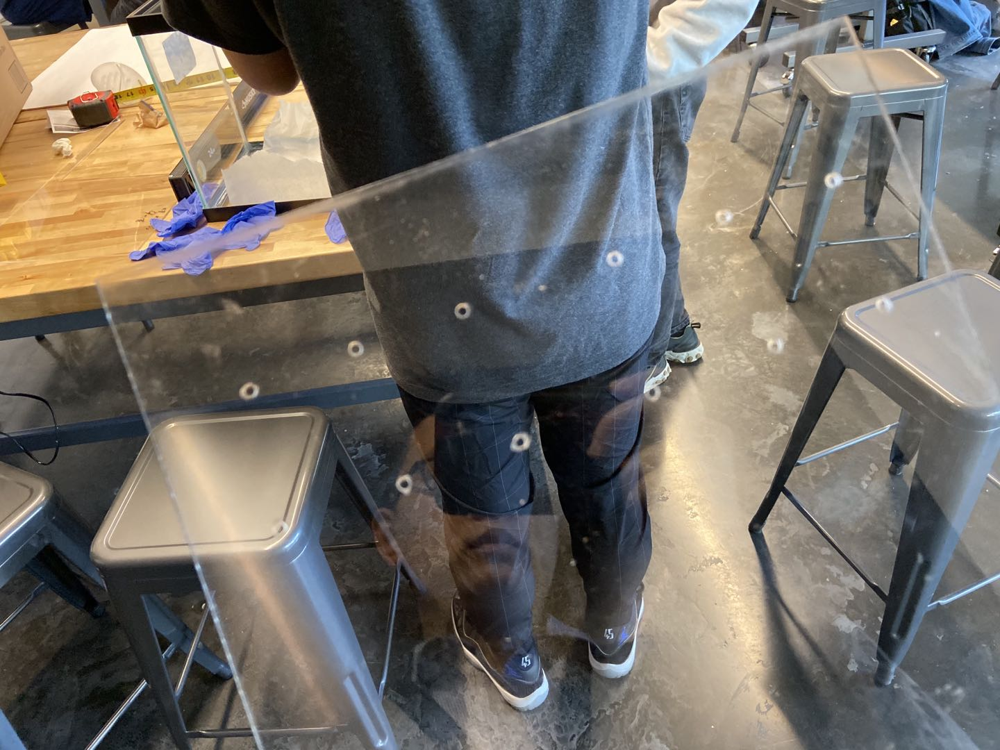
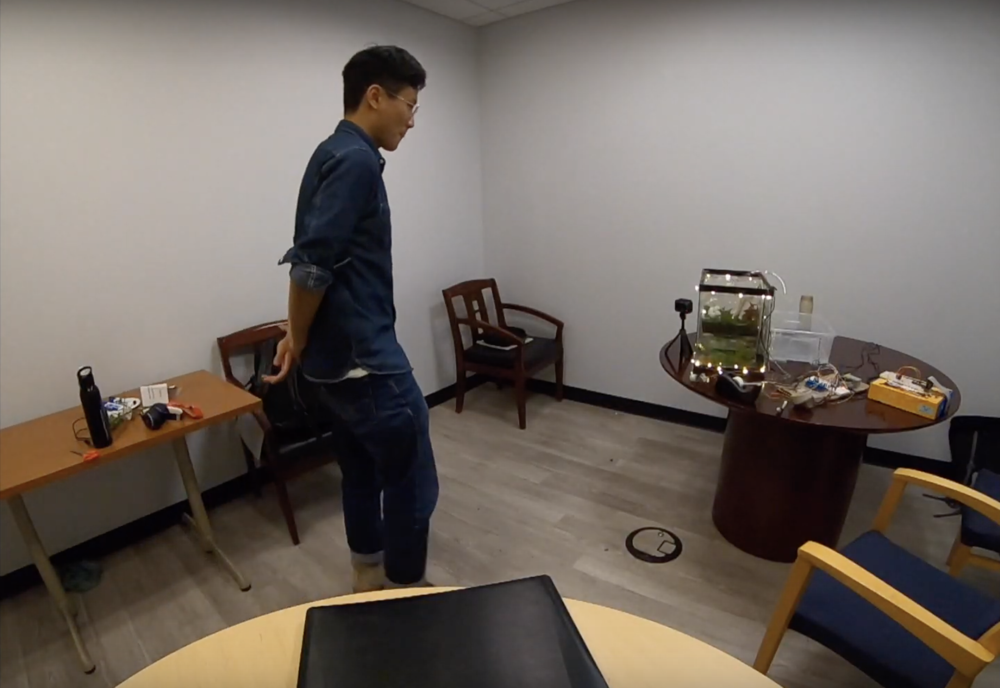
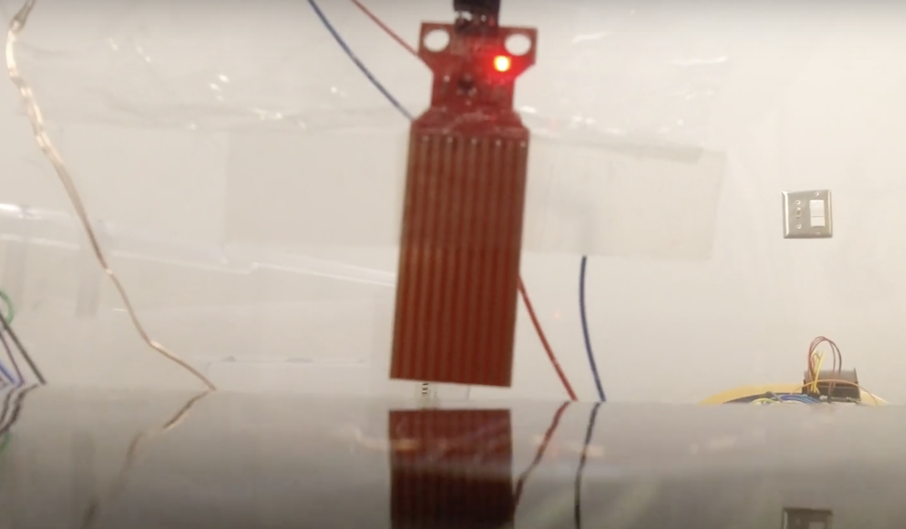
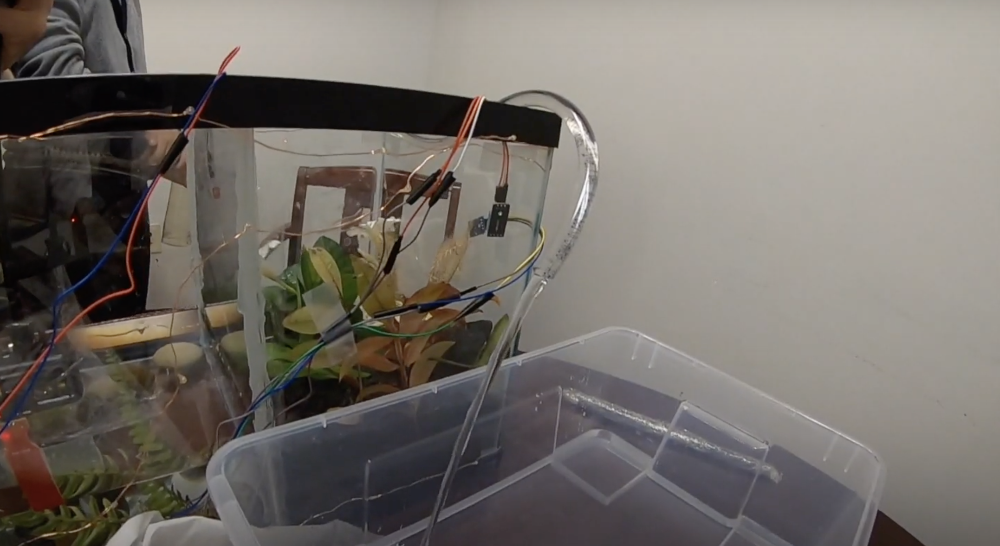
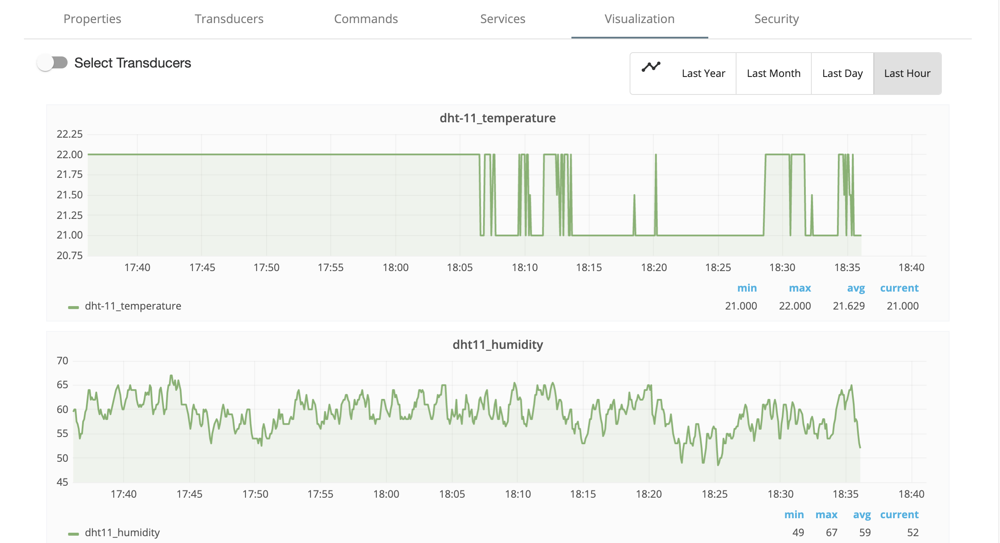

# Smart Aquarium
## 12740-F19-Project

### Group Member: 

    
    
    
    

    
#### [Yilin Wang](mailto:yilinw2@andrew.cmu.edu), [Jiangwen Wei](mailto:jiangwew@andrew.cmu.edu), [Yue Cao](mailto:yuec3@andrew.cmu.edu), [Xiangchao Wang](mailto:xiangchw@andrew.cmu.edu)

### [Progress report for the first two weeks](https://dylan-wyl10.github.io/12740/index.html)
### [Progress report for week(Oct.6th - Oct.14th)](https://dylan-wyl10.github.io/12740/report2.html)
### [Video](https://youtu.be/5DWofieF4k4)

---------------------
## 1. Introduction

* People in the city are living far away from natural at present. The city, fulfilled with concrete and steels, isolates the communication between man and nature. In order to ameliorate this situation, we are going to create a domestic micro biosystem that provide a chance for people to get in touch with the nature at home. The smart micro-biosystem called “Smart Aquarium” that can detect and feedback upon the environmental changes with four types of sensors. It contains water and soil environment which is supposed to react individually to the environment changes through a programmed control center(Figure 1-1). 

-                              Figure 1-1 Diagrammatic sketch for the Smart Aquarium

* The Smart Aquarium can be divided as two parts: Sensor part and Feedback part. A Raspberry Pi is used as a “brain” to process the data from sensors and multiple the relay to control the feedback circuit with Python code. The system was established by a water level sensor, a photosensitive light sensor, an infrared sensor and a temperature & Humidity sensor. The dump will be controlled by a relay based on the data collect from water level sensor. An LED strip was used as a phenomena light resources when the infrared sensor detected the motion of people coming near the tank. 

### 1.1 Motivation

* Sensors utilize a wide spectrum of transducer and signal transformation approaches with corresponding variations in technical complexity(). It conveys a physical input with an electrical or optical signals in an interst of detecting which stimulate the control system finishing a further reaction. Sensors, playing a role as the bond of computer- environment interaction, are the fundamental parts for the computer to measure the environment. AI Group, consisting of four master students in CEE, aims to explore the impact of sensor technology on the future domestic life. By designing a micro-biosystem which smartly responses to the surroundings and gives a feedback accordingly, the group tries to convey the idea of achieving the co-existence of man and nature with advance technologies. Furthermore, they will gain a great experience in applying sensors into real life. Raspberry Pi, a commonly used microcomputer, is used as a central control system for the demo which is able to monitor the humidity and temperature changes in the micro-ecosystem, detect the human motion around itself and react by lighting LED strip up, or change the water in the system automatically. 

### 1.2 Specific Goals

* Our objective is to multiple sensors implementing the concepts learned in Data Acquisition course with an Raspberry Pi, and design a complete system with a loop of censoring and feedback. The supporting goals are:

    1). Using RPI to collect data from the dht11-Tem & Humidity Sensor. 

    2). Mutipling the relay with Raspberry Pi in Python code, then modify relay into the circuit to finish the entire "Feedbace Loop. 

    3). Conneting the water level sensor and photosensitive light sensor with an ADC analog. Then programming the sensor to detect the water level in the tank and give orders to the dump. An incandescent lamp will open up whent he light sensor detects the ambient light is weakdark to provide supplementary light for photosynthesis. 

    4). Achieving a multi - sensor work system. 

---------------------
## 2. Methodology 

### 2.1 Phenomena of Interest

* The aquarium, which can be placed somewhere in the host's house，will automatically adjust the environment such as the water level in the tank. It can also detect the temperature and humidity which will be showing on the moniter terminal. The tank is divided into two seperate parts, one is a mini eco-system of land area and the other is the ocean area(Figure 1-1). The land area, detected by a light sensor, will be provided light from lamp if the room is dark. We assume the plants in this mirco-system are able to photosynthesize when the host is out of house for a long time. As for the water part, a water-level sensor and a dump are installed to control the water level and keep it fresh. The dump, controled by a relay with the electrical signal from the RPI, is responsible for pumping out unfresh water from the tank. The water-level sensor is used to keep the water level in a stable range. These four sensors operate independently of each other at the same time (Figure 2-1).

   Figure 2-1 Graph for System Working Princple

### 2.2 Sensor(s) Review

#### 2.2.1 Water Level Sensor

##### Working Principle

* The Arduino Lesson water sensor(Figure2-2) is an easily used sensor to detect water with a principle of resistor[[1]](http://kookye.com/2018/11/06/arduino-lesson-water-sensor/). It is tiny and easily installed with the following features: 

    1).Judge the water level through with a series of exposed parallel wires stitch to measure the water droplet/water size.
    2).Can easily change the water size to analog signal, and output analog value can directly be used in the program function, then to achieve the function of water level alarm.
    3).Low power consumption, and high sensitivity, which are the biggest characteristics of this mdoule.
Compatible with SainSmart UNO SainSmart mega2560 SainSmart ADK etc.

   Figure 2-2 Water Level Sensor 

#### 2.2.2 Infrared Motion Sensor

##### Working Principle

* PIR Motion Sensor allows to sense motion, almost always used to detect whether a human has moved in or out of the sensors range. They are small, inexpensive, low-power, easy to use and don’t wear out. They are often referred to as PIR, “Passive Infrared”, “Pyroelectric”, or “IR motion” sensors.[[2]](http://kookye.com/2018/11/06/arduino-lesson-pir-motion-sensor/)

* The PIR Motion Sensor is used to detect the motion of human beings around the place. The basic working logic of this sensor is to detect the infrared Body Heat in front of the sensor.(Figure 2-3) It consists of a fresnel lens, an infrared detector, and supporting detection circuitry. The lens on the sensor focuses any infrared radiation present around it towards the infrared detector. Human bodies generate infrared heat which is picked up by the motion sensor. As a result, it outputs a 5V signal for a period of one minute as soon as it detects the presence of a person in a sensitive range of 6-7 meters. 

   Figure 2-3 Working Principle of PIR Motion Sensor[[2]]

* The specific details for PIR Motion Sensor is showed on Table 2-1: 

   Table 2-1 Details about PIR Motion Sensor[[2]](http://kookye.com/2018/11/06/arduino-lesson-pir-motion-sensor/)

Pin or Control | Function
------------ | -------------
Working voltage | 4.5V to 20V
Output | High: 3.3V, Low: 0V
Detection angle | Approximately 120 degrees
Range | Adjustable 3 to 7 meters 
Digital Output Pin | Low when no motion is detected. High when motion is detected. High is 3.3V
Power Pin | 4.5 to 20 VDC Supply input

#### 2.2.3 Photosensitive Light Sensor 

##### Working Principle

* The photosensitive light sensor use a photoresistor (Figure 2-4) to transfer the light changes into resistive value based on how much light is shining onto the squiggly face. The resistance of a photoresistor ture to a few ohms when it is dark outside and a few hundred ohms as well as a lightening environment. The graph showed on Figure 2-5 indicates approximately the resistance of the sensor at different light levels.[[3]](http://kookye.com/2018/11/16/arduino-lesson-sound-detection-sensor-2/)

   Figure 2-4 Photoresistor in sensitive light sensor[3]

* Figure 2-5 from [reference 3](http://kookye.com/2018/11/16/arduino-lesson-sound-detection-sensor-2/) shows the resistance of the sensor and the output voltage.

   Figure 2-5 Photoresistor in sensitive light sensor[3]

#### 2.2.4 Temperature and Humidity Sensor(DHT11)

##### Working Principle

* The DHT11(Figure 2-6) is a basic, ultra low-cost digital temperature and humidity sensor. It uses a capacitive humidity sensor and a thermistor to measure the surrounding air, and spits out a digital signal on the data pin (no analog input pins needed).[[4]](http://kookye.com/2018/11/16/arduino-lesson-dht11-sensor/)

   Figure 2-6 DHT11

* The DHT11 detects water vapor by measuring the electrical resistance between two electrodes. The humidity sensing component is a moisture holding substrate with electrodes applied to the surface. When water vapor is absorbed by the substrate, ions are released by the substrate which increases the conductivity between the electrodes. The change in resistance between the two electrodes is proportional to the relative humidity. Higher relative humidity decreases the resistance between the electrodes, while lower relative humidity increases the resistance between the electrodes.

   Table 2-2 Details about DHT-11

Measurement Variable | DHT-11
------------ | -------------
Temperature Range | 0-50℃ ±2℃
Humidity Range | 20%-80% ± 5%
Sampling Rate | 1Hz
Body Size | 15.5mm×12mm×5.5mm
Operating Voltage | 3.5V
Max During Measuring | 2.5mA

### 2.3 Demo Construction

#### 2.3.1 Relay Circuit 

* Relays are electromechanical devices that use an electromagnet to operate a pair of movable contacts from an open position to a closed position. Relays are used where it is necessary to control a circuit by an independent low-power signal, or where several circuits must be controlled by one signal. Relays were first used in long-distance telegraph circuits as signal repeaters: they refresh the signal coming in from one circuit by transmitting it on another circuit. Relays were used extensively in telephone exchanges and early computers to perform logical operations.[[5]](https://en.wikipedia.org/wiki/Relay))

* A four way relay(Figure 2-7) will be used to control the feedback loop such as dump, LED light strip and light supply lamp when the RPI outputs a change of voltage to the repay after processing the data from each sensors. 

   Figure 2-7 Four Way Relay in Circuit 

* Three of four channels were used in the relay. The first one is connected to water pump, the second is connected to ornamental light and the last one third is connected to LED bulb. All three channels’ wires are tied to the normal open circuit (middle and right screw). If raspberry pi send low level electronic signal, the switch inside relay will close and the corresponding external element circuit is accessed, then the corresponding element will start to work. If the signal is high level, the circuit will open and elements stop working.

* Notice that all three external electronic elements need external power source. Water pump is supplied by five-volt direct current, relay and water pump are in series. Twp screws in the first channel are connected by wire in this circuit. Ornamental light is supplied by three AA batteries, the second way is occupied with two screws,too. LED bulb, supplied by raspberry pi in breadboard, is connected to the anode in breadboard with anode light. Cathode of LED is connected to the right screw of third channel of relay and middle screw is connected to the cathode of breadboard.

#### 2.3.2 Sensor Programming 

BCM method was used to write Python code and control the communication process between sensors and Raspberry Pi. DHT11 temperature & humidity sensor and infrared sensor can directly send digital signals that could be read by Raspberry Pi while  photosensitive and water level sensor, on the other hand, can only send analog signals instead. It means that we need add an Analog to Digital Convert (ADC) and write extra Python method named read_adc_value to convert analog signal to digital signal. After receiving signal value, RPI is required to send command to control relays. Then we connect the ADC module according to the tutorial from Kookye Kit official website to make it work normally, and connect the sensors and relays in Raspberry Pi circuit according to the GPIO number in code, by which our group achieve the working of system controlled by terminal.

#### 2.3.3 Demo Assembly

* Then we connect the ADC module according to the tutorial from Kookye Kit official website to make it work normally, and connect the sensors and relays in Raspberry Pi circuit according to the GPIO number in code, by which our group achieve the working of system controlled by terminal.

* All parts should be put into together after the coding and circuit design (Figure 2-8). We built a tank with glass plate and acrylic plate with drills as a partition of water area and land area (Figure 2-9). The demo was made in the makeplace of ECE department with the guidence of the assistant there. After finishing the physical model, we fixed all the lines and RPI for the demo test (Figure 2-10). 

   Figure 2-8 Connected Sensor

   Figure 2-9 Acrylic Plate

   Figure 2-10 Demo before Final Construction

---------------------

## 3. Experiment 

* A series of tests have been pocessed to test the system and programming. We have tested the sensors and the demo during the project work. We mainly focus on sensor perception performance and output results in sensor test while the collaberations of the feedback ciruit are concrened in the Demo Test. 

### 3.1 Sensor Test

* Infrared sensor has a range of detective distance, a fully test is needed to figure out the sensitivity of this sensor. The output signals of this sensor is electrical, We add a print command into the code to output the value on the terminal screen. Using the same methodolodgy to test the lightsensitive sensor (showed in Figure 3-1, 3-2). 

   Figure 3-1 Sensor Test of Infrared Sensor and Lightsensitive sensor. 

   Figure 3-2 Sensor Test of Infrared Sensor and Lightsensitive sensor. 

* Water-level sensor detect the water level with the change of resistance 

### 3.2 Demo Test

A demo was made to achieve our thoughts after finishing the sensor test and demo construction (Figure3-3). Further test will be done to check if the demo works well. We will run all the code and test the functions. The initial stage is an empty room with the surrounding lights on. Detailed test process is showed on the [video](https://youtu.be/5DWofieF4k4).

   Figure 3-3 Demo of Smart Aquarium

#### Infrared Motion Sensor

* When a man comes into the room and walking close to the tank, the Infrared Motion Sensor will dectect and give a signal to the relay, which will light the LED strip up (Figure 3-4). The light will be off in 20 seconds.

   Figure 3-4 Infrared Motion Test

#### Water Level Sensor

* The water level changes in a certain range instantly and refreshes water automatically with the water-level sensor and the relay. When the water level raises up to the highest level, which is where the sensor are, the pump will be opened by the relay and pumping water for a while (Figure 3-5). 

   Figure 3-5 Water Level Test

#### Photosensitive Light Sensor

* The users don't have to worry about the plant if they go on a long journey away from home becasue the system turn the lamp on to supply light for photosynthesis. The photosensitive light sensor will detect the change of the light in the room and the RPI will decide if the lamp on (Figure 3-6).

   Figure 3-6 Light Sensor Test 

#### DHT-11 Temperature and Humidity Sensor

* The DHT-11 was used as a monitor to detect the temperature and humidity in the tank with a connection to Openchirp platform. It will collect and restore the data (Figure 3-7). The code is attached.

   Figure 3-7 Openchirp Operation 

* The users have the access Openchirp to see the trendancy and graph of the changes in Temperature and Humidity. It is convinent than an "ssh" connection since one can access the data anywhere. 

---------------------
## 4. Discussion

1. We have been able to monitor data through openchirp. It is hoped to further develop a mobile application to attach to the server with a better UI to multiple the devices in tank. 

2. Due to limited funds, we only used one water pump for the test. In fact, as long as there are two pumps with a common set of code, only one is located in the water tank and the other is placed in the water supply source, the functions of pumping water and absorbing water can be realized, thus realizing the real sense of automatic water change.

3. A lot of room can be improved in product design. For example, we can add more waterproof measures to the wire, seal the wire, and wrap the exposed wire; Choose more beautiful light source and provide Wifi connection function; Blend in ecology design on the appearance, let our aquatic animals box have life breath. In order to prepare for further commercialization.

4. Some of the sensors are too sensitive, for example, the infrared sensors are too sensitive, while some are too low, which do not meet our expectations. We want to be able to calibrate the sensors so that they do what we want them to do.

## 5.Reference

* [Sensor toturial for kookye box](http://kookye.com/2016/08/01/smart-home-sensor-kit-for-arduinoraspberry-pi/)
* [What is a relay for Wiki-pedia](https://en.wikipedia.org/wiki/Relay)
